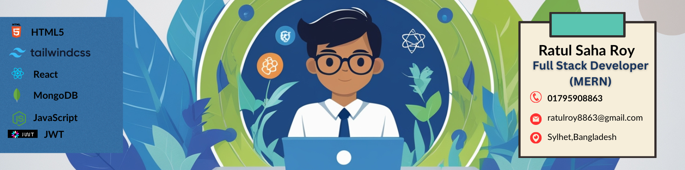

<h1 align="center">Hi 👋, I'm Ratul Saha Roy</h1>
<h3 align="center">A passionate Full Stack Developer building impactful MERN stack web applications from Bangladesh </h3>

  

I’m currently working on building impactful full-stack web applications with MERN stack. I’m also learning AI/ML fundamentals and contributing to projects that combine technology with creativity and communication. 🚀

  

---

### 👨‍💻 About Me

I'm a passionate and enthusiastic Full Stack Developer with a strong focus on the MERN stack.  
I enjoy building user-friendly, scalable web applications and exploring new technologies.  
Currently pursuing a B.Sc. in Computer Science at Metropolitan University.  
I love solving real-world problems and contributing to meaningful projects.

### 🚀 Current Activities

- 🌱 I’m exploring **Next.js** and **TypeScript**
   AI/ML fundamentals ,
  JWT Authentication ,
  Tailwind CSS Pro Styling ,
- 🧠 Working on a **hostel-based web application**
- 💼 Enhancing my **portfolio** with animations and backend integrations
- 🔧 Learning about **serverless deployment** and **Vercel Functions**

---

- 💬 Ask Me About
 **React**, **Firebase Auth**, **Express.js**, **MongoDB**

## ⚡ Fun Fact
- *I'm addicted to learning new tech—my browser has more tabs than Netflix has shows.*
  
## 🌐 Socials:

---

### 🚀 Tech Stack

<table>
  <tr>
    <td align="center" width="120">
      
       <b>HTML5</b>
    </td>
    <td align="center" width="120">
      
       <b>CSS3</b>
    </td>
    <td align="center" width="120">
      
       <b>JavaScript</b>
    </td>
    <td align="center" width="120">
      
       <b>React</b>
    </td>
    <td align="center" width="120">
      
       <b>Node.js</b>
    </td>
  </tr>
  <tr>
    <td align="center" width="120">
      
       <b>Express</b>
    </td>
    <td align="center" width="120">
      
       <b>MongoDB</b>
    </td>
    <td align="center" width="120">
      
       <b>Firebase</b>
    </td>
    <td align="center" width="120">
      
       <b>Git</b>
    </td>
    <td align="center" width="120">
      
       <b>GitHub</b>
    </td>
  </tr>
</table>

---
# 📊 GitHub Stats:
 
 

---

## 🏆 GitHub Trophies

---

### ✍️ Random Dev Quote

---

### 🔝 Top Contributed Repo

---

---

<!-- Proudly created with GPRM ( https://gprm.itsvg.in ) -->

✨ *Thanks for visiting! Let’s connect and build something amazing together.*
